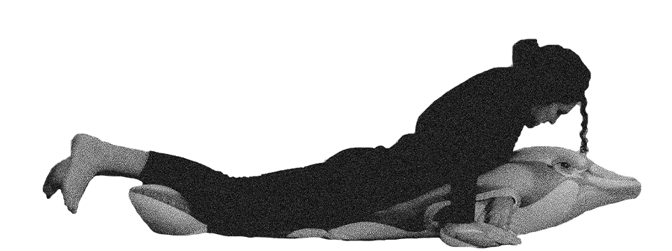

# Sanne-3
Version 3

<!DOCTYPE html>
<html>
<a href="about.html" title="About Me">About Me</a>
<head>
	<title>Ollie Bike Sharing</title>
	<meta charset="utf-8"/>
	<link rel="stylesheet" type="text/css" href="main.css">
</head>
<body>
	<h1>I wish myself a very good luck and work hard on this :)</h1>
	
	
</body>
</html>

